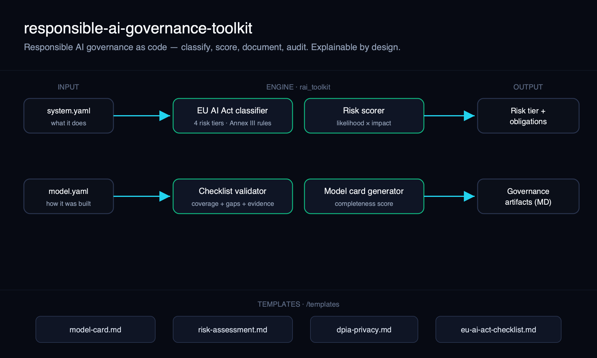
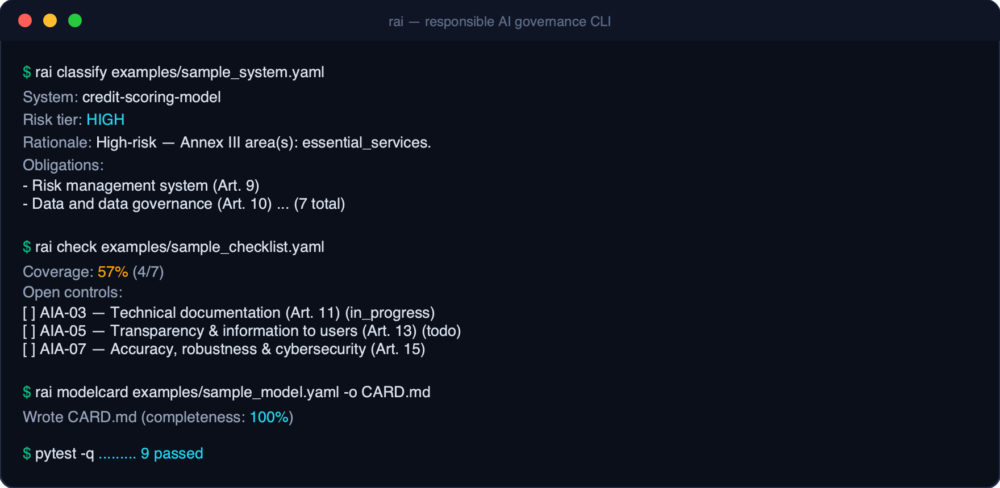

# Responsible AI — Governance Toolkit

[](https://github.com/santismm/responsible-ai-governance-toolkit/actions/workflows/ci.yml)


> Responsible AI governance **as code** — EU AI Act risk classification, risk scoring, model cards and governance checklists. A CLI, a small library, and ready-to-use templates.



## What this is

A practical toolkit that turns governance from documents into something you can
run, version and test. It gives you four things that usually live in scattered
spreadsheets and slide decks:

- **EU AI Act classification** — map a system to one of the four risk tiers and,
  for high-risk systems, the obligations that follow. Every verdict explains the
  rule that fired.
- **Risk scoring** — a transparent likelihood × impact model across fairness,
  privacy, safety, robustness, transparency and security.
- **Model cards** — generate a complete Markdown model card from a YAML spec, with
  a completeness score and explicit flags for undocumented sections.
- **Governance checklists** — validate readiness with evidence-backed controls.

Plus copy-paste [`templates/`](templates) for model cards, risk assessments, DPIAs
and the EU AI Act high-risk checklist.

## Why it matters

"We take AI responsibly" is not auditable. Regulators, risk committees and
customers increasingly want evidence: a documented risk classification, a model
card, a DPIA, a checklist with proof attached. Doing this by hand is slow and
drifts out of date. Encoding it as code makes governance **repeatable, reviewable
in pull requests, and enforceable in CI** — the same discipline you already apply
to software, applied to compliance.

## Architecture

A simple pipeline: structured YAML describing a system or model flows through the
`rai_toolkit` engine (classifier, risk scorer, checklist validator, model-card
generator) and produces governance artifacts. Each engine module is pure,
deterministic and independently testable. See [`docs/architecture.svg`](docs/architecture.svg).

## Demo / screenshots



```text
$ rai classify examples/sample_system.yaml
System:    credit-scoring-model
Risk tier: HIGH
Rationale: High-risk — Annex III area(s): essential_services.
Obligations:
  - Risk management system (Art. 9)
  - Data and data governance (Art. 10)
  ... (7 total)

$ rai check examples/sample_checklist.yaml
Coverage: 57% (4/7)
Open controls:
  [ ] AIA-03 — Technical documentation (Art. 11) (in_progress)
  [ ] AIA-05 — Transparency & information to users (Art. 13) (todo)
  [ ] AIA-07 — Accuracy, robustness & cybersecurity (Art. 15) (in_progress)

$ rai modelcard examples/sample_model.yaml -o CARD.md
Wrote CARD.md  (completeness: 100%)
```

## How to run

Requires Python 3.10+. Runs entirely offline.

```bash
git clone https://github.com/santismm/responsible-ai-governance-toolkit.git
cd responsible-ai-governance-toolkit

python -m venv .venv && source .venv/bin/activate
pip install -e ".[dev]"

rai demo                                       # end-to-end example
rai classify examples/sample_system.yaml       # EU AI Act tier + obligations
rai check examples/sample_checklist.yaml        # checklist coverage + gaps
rai modelcard examples/sample_model.yaml -o CARD.md
pytest -q                                       # run the tests
```

Use it as a library, too:

```python
from rai_toolkit import SystemSpec, classify

spec = SystemSpec(name="cv-screener", domains=["employment"])
result = classify(spec)
print(result.tier.value, "—", result.rationale)   # high — High-risk — Annex III ...
```

## Business use case

- **AI intake / triage.** Run `rai classify` on every proposed AI use case so a
  governance board sees a consistent risk tier and obligation list before approval.
- **Audit readiness.** Keep checklists in the repo next to the system; `rai check`
  turns "are we compliant?" into a number with named gaps and evidence links.
- **Vendor & model documentation.** Standardize model cards across teams and make
  incompleteness visible instead of invisible.

This is the kind of lightweight control layer that lets an organization adopt AI
faster *because* the guardrails are explicit — the governance counterpart to the
[agentic-ai-reference-architectures](https://github.com/santismm/agentic-ai-reference-architectures).

## Responsible AI considerations

- **Explainability first.** Every classification returns the rule and article that
  drove it; nothing is a black box.
- **Evidence over claims.** A checklist control is satisfied only when it is marked
  done *and* references evidence.
- **Honest model cards.** Missing sections are rendered explicitly, never silently
  omitted, so gaps are visible to reviewers.
- **Privacy by design.** Runs locally; ships a GDPR-aligned DPIA template.

## Limitations

- **Not legal advice.** The EU AI Act classifier is decision-support based on a
  simplified reading of Annex III / Art. 5 and Art. 50; confirm with qualified
  counsel. Article references are indicative.
- The rule set is intentionally compact and may not capture every edge case or
  the latest delegated acts — it is meant to be read, audited and extended.
- Risk scoring reflects the assessor's inputs; it structures judgment, it does not
  replace it.

## Roadmap

- [ ] NIST AI RMF and ISO/IEC 42001 control mappings
- [ ] JSON Schema for system / model / checklist specs with validation errors
- [ ] HTML/PDF export of model cards and risk reports
- [ ] Pre-commit hook and GitHub Action to gate merges on governance coverage
- [ ] Worked end-to-end case study under `examples/`

## License

[Apache-2.0](LICENSE) © Santiago Santa María Morales.

## Disclaimer

Opinions are my own. No confidential client or employer information is shared here.
This toolkit is for educational and decision-support purposes and does not
constitute legal or compliance advice.
